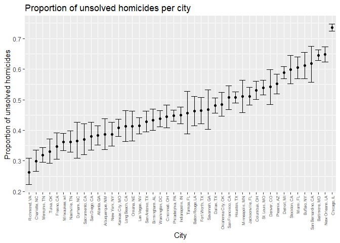

p8105\_hw5\_baw2160
================
Bryce Wong
November 5, 2018

``` r
library(tidyverse)
```

    ## -- Attaching packages ------------------------------------- tidyverse 1.2.1 --

    ## v ggplot2 3.0.0     v purrr   0.2.5
    ## v tibble  1.4.2     v dplyr   0.7.6
    ## v tidyr   0.8.1     v stringr 1.3.1
    ## v readr   1.1.1     v forcats 0.3.0

    ## -- Conflicts ---------------------------------------- tidyverse_conflicts() --
    ## x dplyr::filter() masks stats::filter()
    ## x dplyr::lag()    masks stats::lag()

### Problem 1:

Create a tidy dataframe containing data from all participants, including the subject ID, arm, and observations over time:

-   Start with a dataframe containing all file names; the list.files function will help

``` r
get_names = list.files('./data')
data_prefix = './data/'
file_names = str_c(data_prefix, get_names)
```

-   Iterate over file names and read in data for each subject using purrr::map and saving the result as a new variable in the dataframe

``` r
reading_subjects = function(filename){
  subject_data = read_csv(file = filename) %>% 
    mutate(
      subj_name = filename
    )
  subject_data
}

all_subjects = bind_rows(
  map(.x = file_names, ~ reading_subjects(.x))
) %>% 
  select(subj_name, everything())
```

-   Tidy the result; manipulate file names to include control arm and subject ID, make sure weekly observations are “tidy”, and do any other tidying that’s necessary

``` r
tidy_data = all_subjects %>% 
  gather(key = week, value = observation, week_1:week_8) %>% 
  mutate(subj_name = str_replace(subj_name, "./data/", ""),
         subj_name = str_replace(subj_name, ".csv", ""),
         week = str_replace(week, "week_", ""),
         week = as.numeric(week)
         ) %>%
  separate(subj_name, into = c("study_arm", "subj_id"), sep = "_") %>% 
  mutate(
    subj_id = str_c(study_arm, subj_id),
    observation = as.numeric(observation)
  )
```

-   Make a spaghetti plot showing observations on each subject over time.

``` r
tidy_data %>% 
  ggplot(aes(x = week, y = observation, group = subj_id)) + 
  geom_line(aes(color = study_arm)) +
  labs(
    title = "Observations of each subject over the weeks",
    x = "Week",
    y = "Observations"
  )
```


-   Comments on some differences:
    -   It looks like on average, those in the experimental arm had higher values for observations than those in the control arm.
    -   It also appears as if there is a slight upwards trend over time in observation values for the experimental arm.
    -   By contrast, the control arm seems to have a very slight downwards (or perhaps simply flat) trend over time
    -   Glancing over the plot, The distribution of different subjects seems equally wide for both study arms

### Problem 2:

Loading the data:

``` r
 hom_data = read_csv("https://raw.githubusercontent.com/washingtonpost/data-homicides/master/homicide-data.csv")
```

-   Describe the raw data:
    -   The homicide dataset gives us information about criminal homicides over the past decade in 50 of the largest American cities. Each observation is a unique homicide, with 52179 total observations and 12 variables.
    -   Variables include: uid, reported\_date, victim\_last, victim\_first, victim\_race, victim\_age, victim\_sex, city, state, lat, lon, disposition
    -   The data seems pretty tidy, with each level of a variable part of one dataframe column.
-   Create a city\_state variable (e.g. “Baltimore, MD”) and then summarize within cities to obtain the total number of homicides and the number of unsolved homicides (those for which the disposition is “Closed without arrest” or “Open/No arrest”).

``` r
hom_data_summed = hom_data %>% 
  mutate(
    city_state = str_c(city, ", ", state)
  ) %>% 
  group_by(city_state, disposition) %>% 
  summarize(
    n = n()
  ) %>% 
  spread(key = disposition, value = n) %>% 
  janitor::clean_names() %>% 
  mutate(
    total_homicides = closed_without_arrest + open_no_arrest + closed_by_arrest,
    total_unsolved = closed_without_arrest + open_no_arrest
  ) 
```

-   For the city of Baltimore, MD, use the prop.test function to estimate the proportion of homicides that are unsolved; save the output of prop.test as an R object, apply the broom::tidy to this object and pull the estimated proportion and confidence intervals from the resulting tidy dataframe.

``` r
baltimore = hom_data_summed %>% 
  filter(city_state == "Baltimore, MD")  

prop_unsolved_balt = prop.test(x = baltimore$total_unsolved, n = baltimore$total_homicides)

prop_unsolved_balt_tidy = broom::tidy(prop_unsolved_balt) %>% 
  select(estimate, conf.low, conf.high) %>% 
  knitr::kable(digits = 3)

prop_unsolved_balt_tidy
```

|  estimate|  conf.low|  conf.high|
|---------:|---------:|----------:|
|     0.646|     0.628|      0.663|

-   Now run prop.test for each of the cities in your dataset, and extract both the proportion of unsolved homicides and the confidence interval for each. Do this within a “tidy” pipeline, making use of purrr::map, purrr::map2, list columns and unnest as necessary to create a tidy dataframe with estimated proportions and CIs for each city.

``` r
props_function = function(name){
  city = hom_data_summed %>% 
  filter(city_state == name)  

  prop_unsolved = prop.test(x = city$total_unsolved, n = city$total_homicides)

  prop_unsolved_tidy = broom::tidy(prop_unsolved) %>% 
  select(estimate, conf.low, conf.high)
  
  prop_unsolved_tidy
}

hom_data_summed_props = hom_data_summed %>% 
  filter(!is.na(total_unsolved)) %>% 
  mutate(
    unsolved = map(.x = city_state, ~props_function(name = .x))
    ) %>% 
  unnest() %>% 
  select(city_state, estimate, conf.low, conf.high)

#hom_data_summed_props %>% 
  #knitr::kable(digits = 3)
```

-   Create a plot that shows the estimates and CIs for each city – check out geom\_errorbar for a way to add error bars based on the upper and lower limits. Organize cities according to the proportion of unsolved homicides.

``` r
hom_data_summed_props %>% 
  ungroup() %>% #could also use nest()?
  mutate(city_state = fct_reorder(city_state, estimate)) %>% 
  ggplot(aes(x = city_state, y = estimate)) + 
  geom_point() +
  geom_errorbar(aes(x = city_state, ymin = conf.high, ymax = conf.low)) +
  theme(axis.text.x = element_text(angle = 90, hjust = 1, vjust = 0.5, size = 6)) +
  labs(
    title = "Proportion of unsolved homicides per city",
    x = "City",
    y = "Proportion of unsolved homicides"
  )
```


